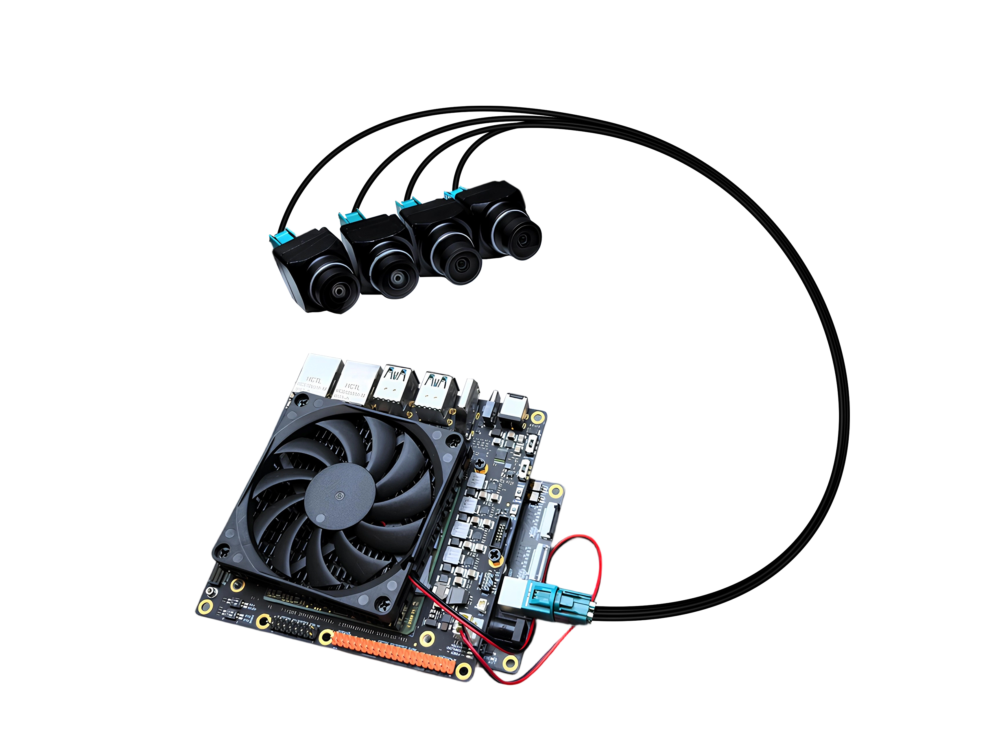

## SENSING Camera Drivers for RDKS100

#### Supported Version

* V4.0.2

#### Hardware Connect

* Using adapt board connect up to 4 cameras
  

#### Power Supply

* RDKS100 board need to be powered by 12V.

#### Camera Version Support

| Type | Camera                      |     V4.0.2    | 
| ---- | --------------------------- | ------------- | 
| YUV  | SG1S-OX01F10C-G1G-Hxxx      | YES           | 
| YUV  | SG2-AR0231C-0202-GMSL-Hxxx  | YES           | 
| YUV  | SG2-AR0233C-5200-G2A-Hxxx   | YES           | 
| YUV  | SG3S-ISX031C-GMSL2F-Hxxx    | YES           | 
| YUV  | SHW3H-Hxxx                  | YES           | 
| YUV  | SHF3L-Hxxx                  | YES           | 
| YUV  | SG8S-AR0820C-5300-G2A-Hxxx  | YES           | 
