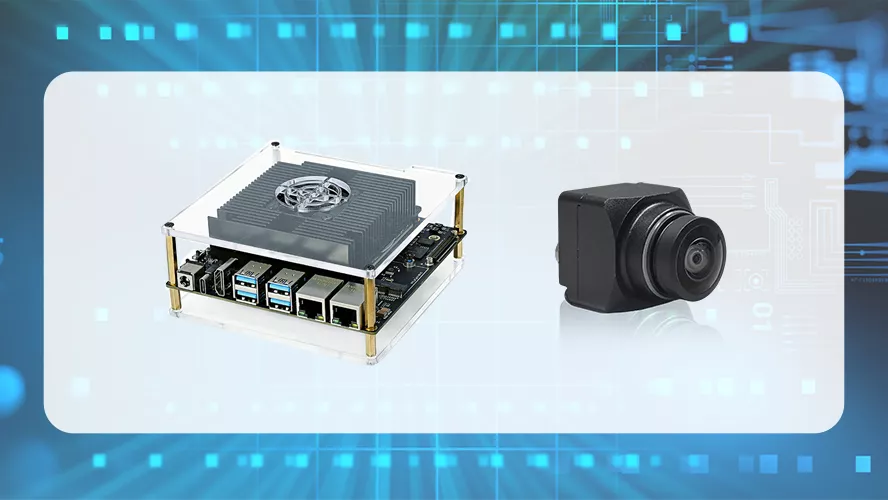

# SENSING Camera Drivers For D-Robotics Devices

SENSING Camera Drivers are developed base on D-Robotics Devices with or without SENSING Deserializer Adapt Board.

Users who are using SENSING Cameras can reference the driver to light up cameras on D-Robotics Devices.

#### **Supported D-Robotics Devices:**

* **RDKS100**

  * Support RDKS100 V0P6 Version
    
